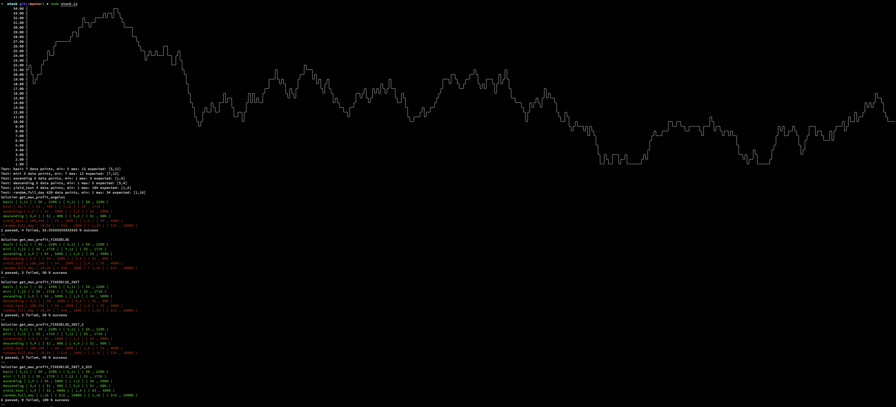

# - Still under development - please do not review until this message is removed!

# Lattitude Stock Price Test
Angelo Perera

## Information
Languages used: Javascript, GoLang.

I've used javascript to quickly test some implementations of an algorithm then my goal is to write production quality code in goLang.

I first started with a simple O(N) implementation with:
- A best variable to store the best known buy and sell values
- A candidate variable to use the current price and test against the best variable

This algorithm was then improved by:
- Removing the "Else if" statement to allow compatibility with small datasets
- Initializing to negatie and positive infinity to remove total number of reads

I then noticed that in some cases since this is stock price movement, that I personally would prefer to get a higher % return on my investment rather than the same increase for a much more expensive stock.

Basically, I would prefer to:
- Buy a stock for $1 and sell for $2 ( Only $1 but %100 profit) RATHER THAN
- Buy a stock for $100 and sell for $104 ( $4 here but only 4% profit)

I created a random walk generator to assert my algorithms accuracy.

See screenshot below:

Finally, the algorithm was re-written in goLang

## How to run

Node:
> yarn install && node stock.js

GoLang:
> go build && ./lattitude-test

Tests: